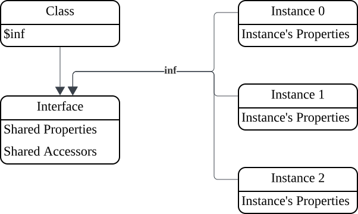

# Classes
## Classes and Objects
In object-oriented programming, we group a set of objects with common characteristics into a class, and these objects can share some identical data. We refer to these objects as instances of the class.

A class is a special type of object. Within a class, we define the data shared by its instances, and we can also generate a new instance by invoking the class.

In the OX language, each object has an internal "inf" pointer that points to an interface object. All instances of the same class share a single interface object.

When accessing a property of an object, the system first looks for the corresponding property within the object itself. If the property is not found, it then searches for the property in the interface object pointed to by the "inf" pointer.

Each class has a "$inf" property that stores the interface object corresponding to the instances of the class. When we invoke a class, the class creates a new object and sets its internal "inf" pointer to point to the value of its own "$inf" property. This completes the creation of a new instance.


## Class Declaration
Classes are declared using the keyword "class".
```
//Declare a class and save it to the constant my_class
my_class: class {
    //Define the $inf.$init method, which is automatically called when an instance is created.
    $init() {
        this.p = 1 //Add property p to the instance
    }
}
```
## Class Members
The following members can be defined within a class definition body, and these members are added as properties to the target object. They can be divided into two categories based on the target object: static objects (the target object is the class object) and dynamic objects (the target object is the interface object):

|Type|Target Object|Description|
|:-|:-|:-|
|Constant|Class Object|Constant values defined in the class|
|Variable|Class Object|Variable values defined in the class|
|Enum|Class Object|Positive integer constants: 0, 1, 2, 3 ...|
|Bitfield|Class Object|Positive integer constants: 1<<0, 1<<1, 1<<2, 1<<3 ...|
|Method|Class Object or Interface Object|A function selected by the "static" keyword to specify the target|
|Accessor|Class Object or Interface Object|Two functions corresponding to the target selected by the "static" keyword, one for reading the property and one for modifying the property|

### Private Properties
If a property name starts with "#", it indicates that the property is a private property. Private properties can only be used within the current file and cannot be referenced by other scripts.
For example, we write a script "test.ox":
```
public MyClass: class {
    $init() {
        this.{
            a: 1
            #priv: 2
        }
    }
}
```
We reference this script in another script:
```
ref "./test" //Reference "test.ox"
ref "std/io"

inst = MyClass() //Create an instance of MyClass

stdout.puts("{inst.a}\n") //Print property "a" 1
stdout.puts("{inst.#priv}\n") //Cannot access private property, returns null
```
### Constants
Constants correspond to read-only properties in the class object. Note that the "static" keyword must be added before defining a constant, or the constant definition must be placed inside a "static" block:
```
my_class: class {
    static {
        C1: 1949
        C2: "const value"
    }
}

stdout.puts("{my_class.C1} {my_class.C2}\n")
```
Note that constants cannot be modified; assigning a value to a constant property of a class will throw an exception:
```
my_class: class {
    static C: 1
}

my_class.C = 0 //Constants cannot be modified, throws an AccessError exception
```
### Variables
Variables correspond to mutable properties in the class object. Note that the "static" keyword must be added before defining a variable, or the variable definition must be placed inside a "static" block:
```
my_class: class {
    static v1 = 1
}

stdout.puts("{my_class.v1}\n") //Print 1

my_class.v1 = 2

stdout.puts("{my_class.v1}\n") //Print 2
```
#### $inf
"$inf" is a special variable of a class, through which we can access the interface object of the class:
```
C: class {
    test() {
        stdout.puts("test\n")
    }
}

C.$inf.test() //Call the test method through the interface. Same result as C().test()
```
### Enum
We often need to define a set of different integer constants for classification:
```
Shape: class {
    static {
        //Define different shape types
        RECT: 0
        CIRCLE: 1
        TRIANGLE: 2
    }

    //Draw the specified shape
    draw(s) {
        case s {
        Shape.RECT {
            draw_rect()
        }
        Shape.CIRCLE {
            draw_circle()
        }
        Shape.TRIANGLE {
            draw_triangle()
        }
        }
    }
}
```
We can use enums to simplify this definition, and the OX interpreter will automatically assign positive integer values 0, 1, 2, 3... to the enum members:
```
Shape: class {
    //Define different shape types
    enum {
        RECT
        CIRCLE
        TRIANGLE
    }
}
```
Enum members have integer values. If we want to find the corresponding name based on the integer value of an enum member, we can give the enum a name to create a name lookup table:
```
Shape: class {
    //Give the enum a name "shape" to create an enum name lookup table property.
    enum shape {
        RECT
        CIRCLE
        TRIANGLE
    }
}

stdout.puts(Shape.shape[Shape.RECT]) //Print "RECT"
stdout.puts(Shape.shape[Shape.CIRCLE]) //Print "CIRCLE"
```
### Bitfield
Sometimes we need to record a collection of several complex states with an integer, where each state is stored in a single bit:
```
//File attributes
FileAttr: class {
    static {
        READABLE: 1 << 0 //File is readable
        WRITABLE: 1 << 1 //File is writable
        SEEKABLE: 1 << 2 //File supports random access
    }

    $init(attrs) {
        this.attrs = attrs
    }
}

fattr1 = FileAttr(FileAttr.READABLE) //Read-only file instance
fattr2 = FileAttr(FileAttr.WRITABLE) //Write-only file instance
fattr3 = FileAttr(FileAttr.READABLE|FileAttr.WRITABLE) //Read-write file instance
```
We can use bitfields to simplify this definition, and OX will automatically assign positive integer values 1, 2, 4, 8... to the bitfield members:
```
FileAttr: class {
    bitfield {
        READABLE //File is readable
        WRITABLE //File is writable
        SEEKABLE //File supports random access
    }
}
```
Bitfield members have integer values. If we want to find the corresponding name(s) based on the integer value of a bitfield member, we can give the bitfield a name to create a name lookup table:
```
FileAttr: class {
    bitfield attr {
        READABLE //File is readable
        WRITABLE //File is writable
        SEEKABLE //File supports random access
    }
}

stdout.puts(FileAttr.attr[FileAttr.READABLE]) //Print array ["READABLE"]
stdout.puts(FileAttr.attr[FileAttr.WRITABLE]) //Print array ["WRITABLE"]
stdout.puts(FileAttr.attr[FileAttr.READABLE|FileAttr.WRITABLE]) //Print array ["READABLE", "WRITABLE"]
```
The bitfield name lookup table returns an array whose members are the names of each set bitfield member.
### Methods
Methods are property functions defined in the class object or interface object. Adding the keyword "static" before a method definition indicates that the method is a property function in the class object. Omitting "static" indicates that the method is a property function in the interface object.
```
my_class: class {
    //Class object property
    static s_method() {
        stdout.puts("static method!\n")
    }

    //Interface object property
    d_method() {
        stdout.puts("dynamic method!\n")
    }
}

my_class.s_method() //Call static method through the class

inst = my_class()

inst.d_method() //Call dynamic method through the instance.
```
OX defines some special methods starting with "$" for internal OX language operations:

|Name|Description|
|:-|:-|
|$init()|Automatically called after an instance is created to initialize the instance.|
|$to_str()|Convert the instance to a string.|
|$to_num()|Convert the instance to a numeric value.|
|$to_json()|Convert the instance to a basic data type supported by JSON when outputting in JSON format.|
|$close()|Close the instance and release resources.|
|$iter()|Create an iterator to traverse the internal elements of the instance.|
|$keys()|Get an array of the names of all properties in the instance|

#### $init
When a new instance is created by invoking a class, the "$init" method of the new instance is automatically called with the parameters passed when invoking the class. We can add instance initialization code in the "$init" method.
```
C: class {
    //Instance initialization method
    $init(v) {
        this.{
            v //Add property "v" to the instance, whose value comes from parameter v
        }
    }
}

inst1 = C(1)
stdout.puts("{inst.v}\n") //Print 1

inst2 = C(2)
stdout.puts("{inst.v}\n") //Print 2
```
#### $to_str
During OX runtime, some operations often require converting values to strings before processing. "$to_str" can define the method for converting an instance to a string:
```
C: class {
    $init(a, b) {
        this.{
            a
            b
        }
    }

    $to_str() {
        return "a:{this.a} b:{this.b}"
    }
}

stdout.puts("{C(1, 2)}\n") //Print a:1 b:2
```
#### $to_num
During OX runtime, some operations often require converting values to numeric values before processing. "$to_num" can define the method for converting an instance to a numeric value:
```
C: class {
    $init() {
        this.v = 0
    }

    inc() {
        this.v += 1
    }

    $to_num() {
        return this.v
    }
}

inst = C()
inst.inc()
inst.inc()
stdout.puts("{inst}\n") //Print 2
```
### Accessors
An accessor corresponds to a pair of functions: one for reading the property and one for setting the property:
```
C: class {
    //Accessor
    a {
        //Read
        return this.v
    } (v) {
        //Set
        this.v = v
    }

    $init() {
        this.v = 1
    }
}

inst = C()

stdout.puts("{inst.a}\n") //Read property a, print 1

inst.a = 2 //Set property a

stdout.puts("{inst.a}\n") //Read property a, print 2
```
If an accessor only contains the read function part, it represents a read-only property. Attempting to set this property will throw an AccessError exception:
```
C: class {
    //Read-only accessor
    a {
        //Read
        return this.v
    }

    $init() {
        this.v = 1
    }
}

inst = C()

stdout.puts("{inst.a}\n") //Read property a, print 1

inst.a = 2 //Cannot set read-only accessor, throws an exception
```
## Class Inheritance
The OX language supports class inheritance. When a subclass inherits from multiple parent classes, the subclass adds all properties defined in the "$inf" interface objects of all parent classes to its own "$inf" interface.

This allows instances of the subclass to call all properties defined in the "$inf" interfaces of the parent classes.
```
parent1: class {
    method_from_p1() {
    }
}

parent2: class {
    method_from_p2() {
    }
}

child: class parent1, parent2 {
    method_child() {
    }
}

inst = child()

inst.method_from_p1() //Method inherited from parent1
inst.method_from_p2() //Method inherited from parent2
inst.method_child() //Method implemented by child itself
```
If the parent class interfaces contain properties with the same name, the properties inherited later will override the previously inherited ones, and those implemented by the subclass itself will override the inherited ones. For example:
```
parent1: class {
    test() {
        stdout.puts("p1\n")
    }
}

parent2: class {
    test() {
        stdout.puts("p2\n")
    }

    test1() {
        stdout.puts("p2\n")
    }
}

child: class parent1, parent2 {
    test1() {
        stdout.puts("child\n")
    }
}

inst = child()

inst.test() //Print "p2"
inst.test1() //Print "child"
```
In the instance initialization method "$init" of a subclass, we may need to first initialize the instance using the "$init" methods of the parent classes. In this case, we can use "Parent.$inf.$init.call()" to call the parent class's "$init" method to initialize the subclass instance.
```
Parent: class {
    $init(v) {
        this.{
            a: v
        }
    }
}

Child: class Parent {
    $init(v1, v2) {
        Parent.$inf.$init.call(this, v1) //Call parent class initialization method
        this.b = v2
    }
}

c = Child(1, 2)
stdout.puts("{c.a} {c.b}\n") //Print 1 2
```
## Syntax Description
```
class_declaration: "class" class_parents? "{" class_items? "}"

class_parents: class_parents "," class_parent
    | class_parent

class_parent: expression

class_items: class_items ";" class_item
    | class_item

class_item: method_declaration
    | accessor_declaration
    | var_declaraction
    | const_declaration
    | enum_declaration
    | bitfield_declaration
    | static_block

static_block: "static" "{" class_items? "}"

method_declaration: "static"? property_name formal_parameters "{" statements "}"

accessor_declaration: "static"? property_name "{" statements "}" accessor_setter?

accessor_setter: "(" formal_parameter ")" "{" statements "}"

var_declaration: "static"? property_name ("=" expression)?

const_declaration: "static"? property_name ":" expression

enum_declaration: "static"? "enum" identifier? "{" enum_items? "}"

enum_items: enum_items "," enum_item
    | enum_item

bitfield_declaration: "static"? "bitfield" identifier? "{" enum_items? "}"
```