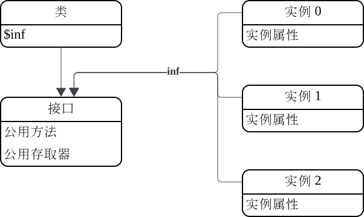

# 类
## 类和对象
在进行面向对象编程时，我们将一组有共性的对象分为一类，这些对象可以共享一些相同的数据。我们称这些对象是这个类的实例。
类是一个特殊的对象，在类中我们定义了实例共用的数据，我们也可以通过调用类生成一个新的实例。

在OX语言中，每个对象有一个内部的"inf"指针，指向一个接口对象。同一个类的实例共用一个接口对象。
当访问一个对象的属性时，先在对象自己的属性中查找，如果没有找到对应属性，则通过"inf"指针查找接口对象的属性。

每个类有一个"$inf"属性，存放了这个类实例对应的接口对象，当我们调用类时，类会创建一个新对象，并将其内部"inf"指针指向自己的"$inf"属性值。这样就完成了一个新实例的创建。


## 类声明
通过关键字"class"声明类。
```
//声明类并将其保存到常量my_class中
my_class: class {
    //定义$inf.$init方法，此方法在创建实例时自动调用。
    $init() {
        this.p = 1 //向实例中添加属性p
    }
}
```
## 类成员
在类定义体中可以定义以下成员，这些成员作为属性添加到目标对象中。按目标对象不同，可以分为两类，静态对象(目标对象为类对象)和动态对象(目标对象为接口对象)：

|类型|目标对象|描述|
|:-|:-|:-|
|常量|类对象|类中定义的常量值|
|变量|类对象|类中定义的变量值|
|枚举|类对象|正整数常量: 0, 1, 2, 3 ...|
|位域|类对象|正整数常量: 1<<0, 1<<1, 1<<2, 1<<3 ...|
|方法|类对象或接口对象|通过"static"关键字选择目标，对应一个函数|
|存取器|类对象或接口对象|通过"static"关键字选择目标，对应两个函数，一个用于读取属性，一个用于修改属性|

### 私有属性
如果一个属性名以"#"开头，表示这个属性是一个私有属性。私有属性只能在当前文件内部使用，其他脚本无法引用此属性。
比如我们编写一个脚本"test.ox"：
```
public MyClass: class {
    $init() {
        this.{
            a: 1
            #priv: 2
        }
    }
}
```
在另一个脚本中我们引用这个脚本：
```
ref "./test" //引用"test.ox"
ref "std/io"

inst = MyClass() //创建MyClass实例

stdout.puts("{inst.a}\n") //打印属性"a" 1
stdout.puts("{inst.#priv}\n") //无法访问私有属性，返回null
```
### 常量
常量对应类对象中的只读属性。注意常量定义前要加"static"或把常量定义放在"static"块中:
```
my_class: class {
    static {
        C1: 1949
        C2: "const value"
    }
}

stdout.puts("{my_class.C1} {my_class.C2}\n")
```
注意常量无法修改，对类的常量属性赋值会抛出异常:
```
my_class: class {
    static C: 1
}

my_class.C = 0 //常量无法修改，抛出AccessError异常
```
### 变量
变量对应类对象中的可变属性。注意变量定义前要加"static"或把变鲁定义放在"static"块中:
```
my_class: class {
    static v1 = 1
}

stdout.puts("{my_class.v1}\n") //打印 1

my_class.v1 = 2

stdout.puts("{my_class.v1}\n") //打印 2
```
#### $inf
"$inf"为类的一个特殊变量，可以通过这个变量访问类的接口对象:
```
C: class {
    test() {
        stdout.puts("test\n")
    }
}

C.$inf.test() //通过接口调用test方法。与C().test()结果相同
```
### 枚举
我们经常需要定义一组不同的整数常量用于分类：
```
Shape: class {
    static {
        //定义不同的颜色类型
        RECT: 0
        CIRCLE: 1
        TRIANGLE: 2
    }

    //画指定图形
    draw(s) {
        case s {
        Shape.RECT {
            draw_rect()
        }
        Shape.CIRCLE {
            draw_circle()
        }
        Shape.TRIANGLE {
            draw_triangle()
        }
        }
    }
}
```
我们可以使用枚举简化这种定义，OX解释器会自动为枚举的成员分配正整数值0,1,2,3...:
```
Shape: class {
    //定义不同的颜色类型
    enum {
        RECT
        CIRCLE
        TRIANGLE
    }
}
```
枚举型成员的值为整数，如果我们希望能根据枚举成员的整数值查找其对应的名称，我们可以给枚举一个名字创建名称查找表：
```
Shape: class {
    //给枚举一个名字"shape",创建了一个枚举名查找表属性。
    enum shape {
        RECT
        CIRCLE
        TRIANGLE
    }
}

stdout.puts(Shape.shape[Shape.RECT]) //打印"RECT"
stdout.puts(Shape.shape[Shape.CIRCLE]) //打印"CIRCLE"
```
### 位域
有时我们需要用一个整数记录几种复杂的状态集合，每一种状态用一个bit存储：
```
//文件属性
FileAttr: class {
    static {
        READABLE: 1 << 0 //文件可读
        WRITABLE: 1 << 1 //文件可写
        SEEKABLE: 1 << 2 //文件可以随机访问
    }

    $init(attrs) {
        this.attrs = attrs
    }
}

fattr1 = FileAttr(FileAttr.READABLE) //只读文件实例
fattr2 = FileAttr(FileAttr.WRITABLE) //只写文件实例
fattr3 = FileAttr(FileAttr.READABLE|FileAttr.WRITABLE) //可读写文件实例
```
我们可以使用位域简化这种定义，OX会自动为枚举的成员分配正整数值1,2,4,8...:
```
FileAttr: class {
    bitfield {
        READABLE //文件可读
        WRITABLE //文件可写
        SEEKABLE //文件可以随机访问
    }
}
```
位域成员的值为整数，如果我们希望能根据位域成员的整数值查找其对应的名称，我们可以给位域一个名字创建名称查找表：
```
FileAttr: class {
    bitfield attr {
        READABLE //文件可读
        WRITABLE //文件可写
        SEEKABLE //文件可以随机访问
    }
}

stdout.puts(FileAttr.attr[FileAttr.READABLE]) //打印数组["READABLE"]
stdout.puts(FileAttr.attr[FileAttr.WRITABLE]) //打印数组["WRITABLE"]
stdout.puts(FileAttr.attr[FileAttr.READABLE|FileAttr.WRITABLE]) //打印数组["READABLE", "WRITABLE"]
```
位域名称查找表返回一个数组，成员为每个被设置的位域成员名称。
### 方法
方法为类对象或接口对象中定义的属性函数。方法定义前加关键字"static"表示方法为类对象中的属性函数。不加"static"表示方法为接口对象中的属性函数。
```
my_class: class {
    //类对象属性
    static s_method() {
        stdout.puts("static method!\n")
    }

    //接口对象属性
    d_method() {
        stdout.puts("dynamic method!\n")
    }
}

my_class.s_method() //通过类调用静态方法

inst = my_class()

inst.d_method() //通过实例调用动态方法。
```
OX中定义了一些名称以"$"开头的特殊方法，用来进行一些OX语言内部操作：

|名称|说明|
|:-|:-|
|$init()|当实例创建后自动调用进行实例初始化。|
|$to_str()|将实例转化为字符串。|
|$to_num()|将实例转化为数值。|
|$to_json()|当需要用JSON格式输出时，将实例转化为JSON支持的基本数据类型。|
|$close()|关闭实例，释放资源。|
|$iter()|创建一个遍历实例内部元素的迭代器。|
|$keys()|获取实例中所有属性的名称数组|

#### $init
当通过调用类创建新实例时，会自动调用新实例的"$init"方法，参数为调用类时传递的参数，可以在"$init"方法中增加实例初始化代码。
```
C: class {
    //实例初始化方法
    $init(v) {
        this.{
            v //实例增加属性"v"，其值来自参数v
        }
    }
}

inst1 = C(1)
stdout.puts("{inst.v}\n") //打印 1

inst2 = C(2)
stdout.puts("{inst.v}\n") //打印 2
```
#### $to_str
在OX运行时，一些操作经常需要将值传化为字符串再进行操作。"$to_str"可以定义实例转化为字符串的方法：
```
C: class {
    $init(a, b) {
        this.{
            a
            b
        }
    }

    $to_str() {
        return "a:{this.a} b:{this.b}"
    }
}

stdout.puts("{C(1, 2)}\n") //打印 a:1 b:2
```
#### $to_num
在OX运行时，一些操作经常需要将值传化为数值再进行操作。"$to_num"可以定义实例转化为数值的方法：
```
C: class {
    $init() {
        this.v = 0
    }

    inc() {
        this.v += 1
    }

    $to_num() {
        return this.v
    }
}

inst = C()
inst.inc()
inst.inc()
stdout.puts("{inst}\n") //打印2
```
### 存取器
一个存取器对应一对函数，一个用来读取属性，一个用来设置属性:
```
C: class {
    //存取器
    a {
        //读取
        return this.v
    } (v) {
        //设置
        this.v = v
    }

    $init() {
        this.v = 1
    }
}

inst = C()

stdout.puts("{inst.a}\n") //读取属性a, 打印 1

inst.a = 2 //设置属性a

stdout.puts("{inst.a}\n") //读取属性a, 打印 2
```
如果一个存取器只包含读取函数部分，则代表这是一个只读属性。对这个属性进行设置操作会抛出AccessError异常：
```
C: class {
    //只读存取器
    a {
        //读取
        return this.v
    }

    $init() {
        this.v = 1
    }
}

inst = C()

stdout.puts("{inst.a}\n") //读取属性a, 打印 1

inst.a = 2 //不能设置只读存取器，抛出异常
```
## 类继承
OX语言支持类的继承。当一个子类继承几个父类时，子类会把所有父类的"$inf"接口对象中定义的属性添加到自己的"$inf"接口中。
这样子类的实例就可以调用所有父类"$inf"接口中定义的属性了。
```
parent1: class {
    method_from_p1() {
    }
}

parent2: class {
    method_from_p2() {
    }
}

child: class parent1, parent2 {
    method_child() {
    }
}

inst = child()

inst.method_from_p1() //继承自parent1的方法
inst.method_from_p2() //继承自parent2的方法
inst.method_child() //child自己实现的方法
```
如果父类定义接口中包含同名的属性，后继承的属性会覆盖之前继承的属性，子类自己实现的会覆盖继承的属性。如：
```
parent1: class {
    test() {
        stdout.puts("p1\n")
    }
}

parent2: class {
    test() {
        stdout.puts("p2\n")
    }

    test1() {
        stdout.puts("p2\n")
    }
}

child: class parent1, parent2 {
    test1() {
        stdout.puts("child\n")
    }
}

inst = child()

inst.test() //打印"p2"
inst.test1() //打印"child"
```
在子类的实例初始化方法"$init"中，我们可能需要先用父类"$init"方法对实例进行初始化，此时我们可以使用"Parent.$inf.$init.call()"来调用父类的"$init"方法初始化子类实例。
```
Parent: class {
    $init(v) {
        this.{
            a: v
        }
    }
}

Child: class Parent {
    $init(v1, v2) {
        Parent.$inf.$init.call(this, v1) //调用父类初始化方法
        this.b = v2
    }
}

c = Child(1, 2)
stdout.puts("{c.a} {c.b}\n") //打印 1 2
```
## 语法描述
```
class_declaration: "class" class_parents? "{" class_items? "}"

class_parents: class_parents "," class_parent
    | class_parent

class_parent: expression

class_items: class_items ";" class_item
    | class_item

class_item: method_declaration
    | accessor_declaration
    | var_declaraction
    | const_declaration
    | enum_declaration
    | bitfield_declaration
    | static_block

static_block: "static" "{" class_items? "}"

method_declaration: "static"? property_name formal_parameters "{" statements "}"

accessor_declaration: "static"? property_name "{" statements "}" accessor_setter?

accessor_setter: "(" formal_parameter ")" "{" statements "}"

var_declaration: "static"? property_name ("=" expression)?

const_declaration: "static"? property_name ":" expression

enum_declaration: "static"? "enum" identifier? "{" enum_items? "}"

enum_items: enum_items "," enum_item
    | enum_item

bitfield_declaration: "static"? "bitfield" identifier? "{" enum_items? "}"
```
